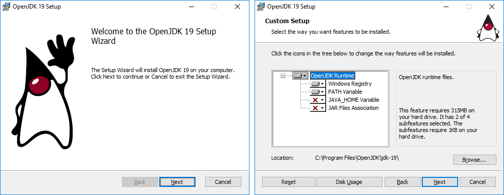

OpenJDK MSI installer for Windows
=================================

Upstream OpenJDK project currently lacks support for packaging jdk into an installer for Windows OS.
At the same time, majority of OpenJDK vendors provide installer packages for OpenJDK distributions on Windows.

This implementation adds two build targets:

 - `make installer-msi`: produces a vanilla upstream MSI installer from a jdk image
 - `make installer-msi-xml`: produces an installer description as a single XML file
that can be used by OpenJDK vendors to create extended installers based on a vanilla one

Overview
--------

See [JEP_DRAFT.md](JEP_DRAFT.md) for details.



Goals are the following:

 - allow to build a fully functional (albeit basic) installer from upstream OpenJDK repository without requiring
 any additional scripts and resources (except MSI build tools that need to be provided)
 - allow to create an installer description (for MSI build tools) in a form that it can be used by
 OpenJDK vendors to extend vanilla installer with additional selectable features; provide documentation
 and extension examples

The first point is targeted at "casual users" who may want to have a basic installer that they can easily rebuild if needed.

The second point is targeted at enterprise OpenJDK vendors who may want to use a vanilla installer as a "base layer"
and extend it with vendor-specific features, instead of creating their installers from scratch.
 
Implementation with JPackage
----------------------------

See [JPACKAGE.md](JPACKAGE.md) for details.

Implementation tries to leverage the `jpackage` tool (from [JEP 392: Packaging Tool](https://openjdk.java.net/jeps/392))
functionality where possible.

[MSI installers](https://en.wikipedia.org/wiki/Windows_Installer) built with a [WiX toolset](https://wixtoolset.org/)
are a de-facto standard for Windows installers.
This approach is used by many big open-source projects like Node.js or CMake. In general, such installers are created
by running utilities from WiX toolset providing an XML description as an input.

`jpackage` tool supports creating MSI installers using WiX tools under the hood. In this case `jpackage` collects a set of
installation files, generates an XML-like description and calls WiX tools to create resulting installer. 

In current implementation vanilla installer is created by running `jpackage` on the "make images" output and providing it
a modified input template to support additional selectable features. It is intended to contribute support for these
features to the `jpackage` tool and to use only default `jpackage` template.

`jpackage`, being an universal packaging tool, generates description files with a sole purpose to be used as an input
to WiX toolset. Resulting set of XML and XML-like files is not optimized to be easily extendable. This implementation adds
a `CreateExtXml.java` build tool that transforms `jpackage` output into a single XML file that should be easier to extend.

GUI forms
---------

See [GUI.md](GUI.md) for details.

WiX toolset provides a set of "standard" default GUI forms that can be personalized with images.
This implementation uses only default GUI forms. Images for it are based on OpenJDK Duke art.

Building vanilla upstream installer
-----------------------------------

See [BUILD.md](BUILD.md) for details.

The only tool, that is required in addition to usual jdk build tools, is a [WiX toolset](https://wixtoolset.org/).
When WiX is installed, it sets the `WIX` environment variable.

Configure jdk Windows build as usual and check that the following line is included in `configure` output:

```
bash configure --with-boot-jdk=...
...
checking for WiX toolset... yes, /cygdrive/c/progra~2/wixtoo~1.11/
```

Run the `installer-msi` build target:

```
make installer-msi
...
Creating jdk image
...
Creating MSI installer in /cygdrive/c/projects/openjdk/jdk/build/windows-x86_64-server-release/images/installer/msi
...
Finished building target 'installermsi' in configuration 'windows-x86_64-server-release'
```

Test coverage
-------------

See [TEST.md](TEST.md) for details.

A set of JTreg tests is included with the implementation. These tests are added to the `jpackage` test-suite
and perform actual installation/uninstallation of the MSI package, thus they can only be run under the OS user
with `Administrator` privileges.

In addition to this, extension tests (that cover the extending of a vanilla installer) perform a transformation
of XML description and create new extended installer packages. These tests require additional tools and resources
that need to be specified using system environment variables: `WIX`, `DENO_HOME`, `INSTALLERMSI_JAXB_EXTEND_LIBS_DIR`.
If some of the resources are not available - corresponding tests are skipped.

Extending the installer
-----------------------

See [README.md](../../../../test/jdk/tools/jpackage/windows/installermsi/README.md) for details.

OpenJDK vendors may want to use vanilla installer as a "base layer" and extend it with vendor-specific features,
instead of creating their installers from scratch. Vendors can create a single-file XML description using
`make installer-msi-xml` and transform it, changing the labels and adding new component/features.

Three different transformation examples are included with the implementation (in `jdk/test/jdk/tools/jpackage/windows/installermsi` directory),
all examples are functionally equivalent (produce the same modified MSI):

 - `ExtendDom.java`: XML is loaded as a DOM tree and then transformed using `org.w3c.dom` API
 - `ExtendJaxb.java`: XML is loaded as a strongly-typed JAXB-generated object
 - `ExtendScript.js`: XML is loaded as a JavaScript object
